# API CompassCar - Deploy AWS 

Anteriormente foi craida uma API RESTful projetada para o gerenciamento da locação de carros. Que permite o gerenciamento de usuários, o cadastro de clientes, o controle de carros disponíveis para locação e a criação e acompanhamento de pedidos de locação.

Nesta etapa será realizada o deploy dessa API utilizando serviços da AWS.

## Links Externos

- [Documentação do Swagger](https://aws-node-ago-24-bucket.s3.amazonaws.com/index.html)
- [Repositório GitHub](http://github.com/rickRiquie/aws_node_ago24_desafio03_aws)
- Link público para API (https://ec2-3-17-12-14.us-east-2.compute.amazonaws.com:8080/login).
   ```bash
    "email": "usuario@example.com",
    "password": "senha@123"`
   ```
## Índice

Para facilitar a navegação, você pode acessar diretamente as etapas do deploy abaixo:

- [Pré-requisitos](#pré-requisitos)
- [Gerando o HTML do Swagger](#gerando-o-html-do-swagger)
- [Configuração do S3](#configuração-do-s3)
- [Configuração da EC2](#configuração-da-ec2)
- [Configuração da VPC](#configuração-da-vpc)
- [Configuração Security Group](#configuração-security-group)
- [Configuração de Key Pair](#configuração-de-key-pair)
- [Criando instância EC2](#criando-instância-ec2)
- [Utilizando PuTTy e PuTTYgen](#utilizando-putty-e-puttygen)
- [Utilizando o Terminal](#utilizando-o-terminal)
- [Utilizando MobaXterm](#utilizando-mobaxterm)
- [Hora do deploy](#hora-do-deploy)
- [Deploy Automatizado para EC2 com GitHub Actions](#deploy-automatizado-para-ec2-com-github-actions)
  
---

## Pré-requisitos

Antes de começar, verifique se você tem os seguintes pré-requisitos:

- **Uma conta na AWS**: Uma conta na AWS para criar e gerenciar recursos como EC2, S3, etc.
- **Amazon S3**: Uma configuração de bucket no S3 para armazenar e disponibilizar o Swagger. Certifique-se de que o bucket esteja criado e configurado para acesso público, conforme descrito na seção [Configuração do S3](#configuração-do-s3).
- **Instância EC2**: O deploy da aplicação será realizado em uma instância EC2. Você pode criar uma instância seguindo as instruções na seção [Configuração da EC2](#configuração-da-ec2) e [Criando instância EC2](#criando-instância-ec2) 
- **Git**: O Git será instalado diretamente na instância EC2 para clonar o repositório e gerenciar o código-fonte.

---

### **Gerando o HTML do Swagger**

Para gerar o HTML do Swagger, utilizei a biblioteca **Redocly**, que permite a criação de uma interface interativa para visualizar a documentação da API. Abaixo estão os passos para gerar o arquivo `index.html` com base no arquivo `swagger.yml`:

Redocly pode ser utilizado diretamente via **npx**, portanto, não é necessário instalar a biblioteca globalmente. O comando abaixo utiliza **npx** para executar o Redocly:

```bash
npx @redocly/cli build-docs ./swagger.yml -o ./index.html
```
---

## Configuração do S3

#### Passo 1: Criar um Bucket no S3
1. Abra a console da AWS.
2. Na barra de pesquisa, procure por **S3**.


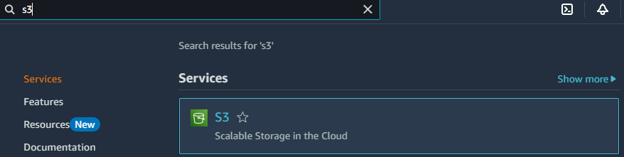

   
3. Selecione a **região** onde deseja criar o bucket.


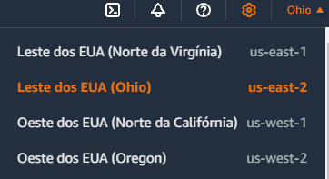

   
4. Clique em **"Criar bucket"**.


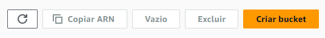

5. Escolha um **nome único** para o bucket ( por exemplo, `aws-node-ago-meu-bucket` ).


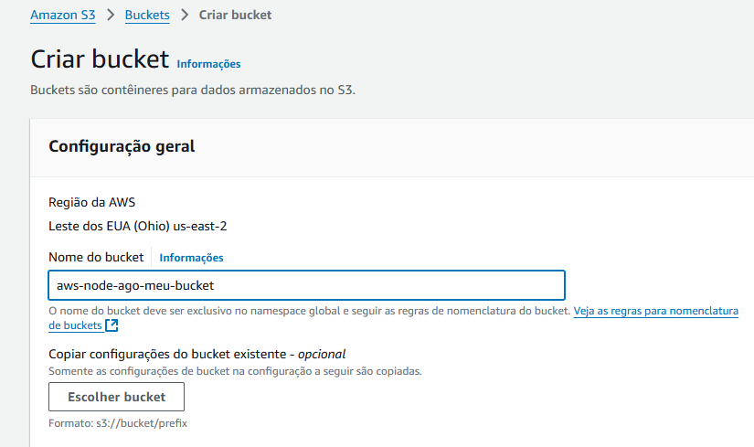


#### Passo 2: Configurar bucket
1. Na aba de **Propreidade de objeto** deixe as ACLs desabilitadas ( recomendado )


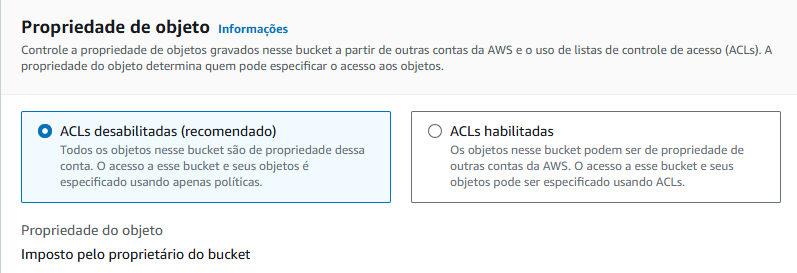

   
2. Em **Configuração de bloqueio do acesso público deste bucket**, desmareque a opção de **Bloquear todo o acesso público**.


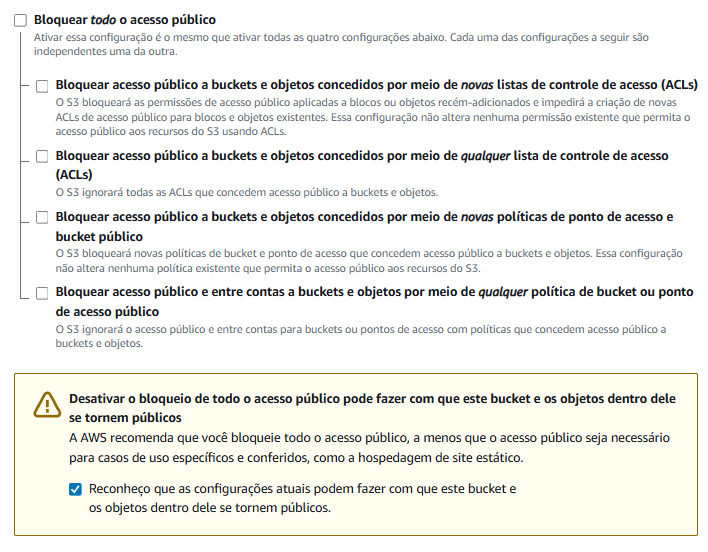


3. Depois clique em **Criar bucket**.


### Passo 3: Configurar Permissões
1. No console do S3, entre no bucket que você acabou de criar.


   
2. Vá até a aba **"Permissões"**.


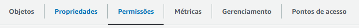


3. Procure por **Política do bucket** e clique em **Editar**.


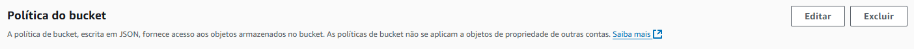


4. Adicione uma política de bucket para permitir acesso público. Uma política básica pode ser assim:
   
   ```json
   {
    "Version": "2012-10-17",
    "Statement": [
        {
            "Effect": "Allow",
            "Principal": "*",
            "Action": "s3:GetObject",
            "Resource": "arn:aws:s3:::sua-bucket/*"
        }
      ]
   }


### Passo 4: Hospedagem de site estático
1. No console do S3, entre no bucket que você criou.
2. Vá até **Propriedades**.


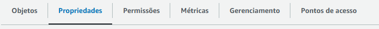


3. Procure por **Hospedagem de site estático**, e clique em **editar**.


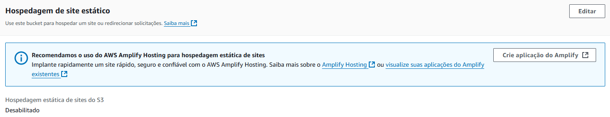


4. Ao abrir a nova aba, ative a opção de **Hospedagem de site estático**


5. Em **Documneto de ídice**, adicione o nome do arquivo que irá usar, exemplo: `index.html`.


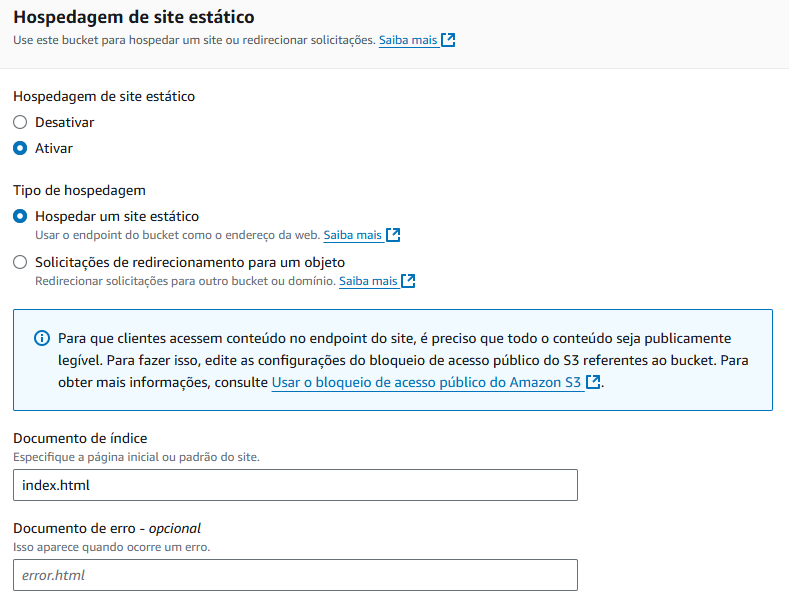


6. Salve as alterações e volte para a Console do S3.


### Passo 5: Adicionar arquivos ao bucket

1. No console do S3, clique em **Carregar**.


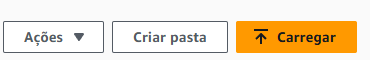


2. Clique em **Adicionar arquivos**, selecione o arquivo html do swagger ( `index.html`)

3. Desça a tela até **Propriedades** e clique.

4. Procure por **Metadados** e adicione o seguinte metadado:
   
**Tipo:** `Definido pelo sistema` | **Chave:** `Content-Type` | **Valor:** `text/html; charset=UTF-8`

Agora, quando o arquivo for acessado via URL pública ou usado em sua aplicação, ele será exibido corretamente como HTML com suporte a caracteres UTF-8.

5. Finalize clicando em **Carregar** ).
   

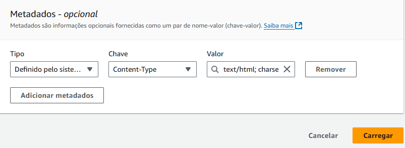


**Pronto o seu html já está na web, para ver ele basta selecionar sua bucket ir em **Propriedades** ir até **Hospedagem de site estático** e lá estará a URL, cole no seu navegador e pronto.**

---

## Configuração da EC2

### Configuração da VPC

A VPC é fundamental para isolar a infraestrutura de rede, fornecendo controle sobre os endereços IP, sub-redes e segurança da sua aplicação.

1. Abra a console da AWS.
2. Na barra de pesquisa, procure por **VPC**.


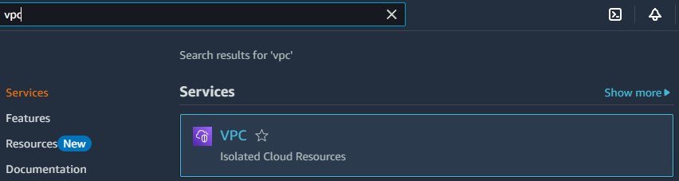


3. Clique em **Criar VPC**.


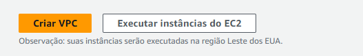

   
4. Selecione **VPC e muito mais** para criar a VPC e outros recursos de rede.


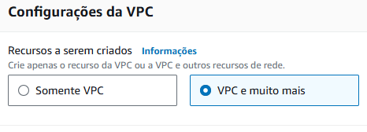


5. Escolha um nome para sua VPC.


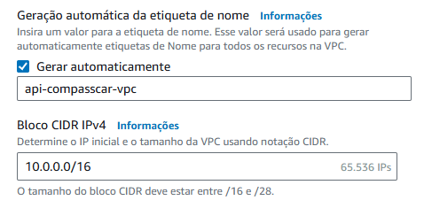

   
6. No final da tela, clique em **Criar VPC** para finalizar o processo.


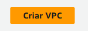

---

### Configuração Security Group

#### Passo 1: Detalhes básicos 

1. No console da EC2, vá para **Security groups**.


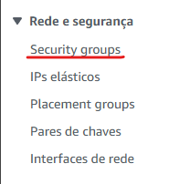

   
2. Clique em **Criar grupo de segurança**.


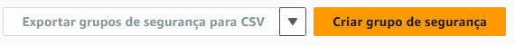


3. Escolha um nome para o security group.
4. Em **Descrição** insira uma breve descrição.
5. Em **VPC** selecione a VPC que você criou.

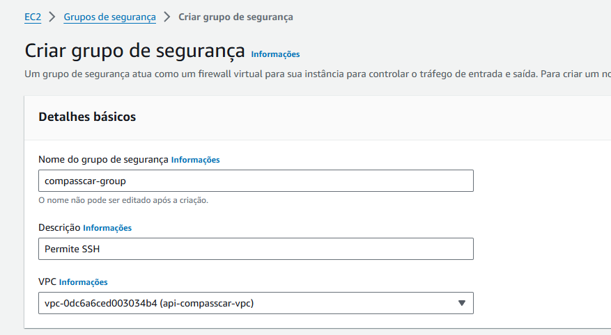


#### Passo 2: Regras de entrada

1. **Entrada SSH**:
      Adicione uma regra: Selecione **SSH**.
      Defina a **Origem**: **Qualquer IPv4**.

2. **Entrada TCP**:
      Adicone uma regra: Selecione **TCP**.
      Informe uma porta: 8080 (recomendado).
      Defina a **Origem**: **Qualquer IPv4**.

#### Passo 3: Regras de saída

1. **Todo o tráfego**:
      Defina o **Destino**: **Qualquer IPv4**.


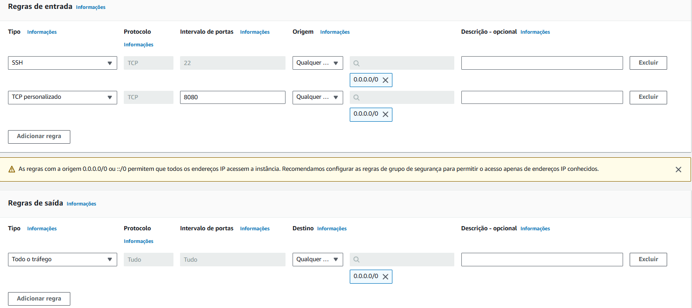


2. Clique em **Criar grupo de segurança**.


---

### Configuração de Key Pair

1. No console da EC2, vá para **Pares de chaves**.


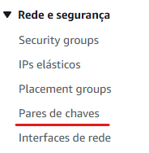


2. Clique em **Criar par de chaves**.


3. Escolha um nome para seu par de chaves.
4. Tipo de par de chaves deixe como **RSA**.
5. Formato de arquivo de chave privada deixe como `.pem`
6. Clique em **Criar par de chaves**


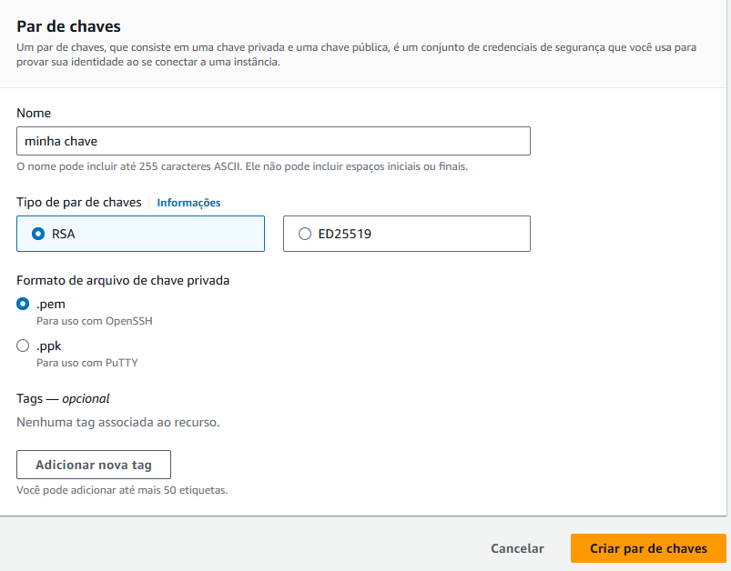


**Importante!** Após esses passo um arquivo será baixado em seu computador, será a sua chave.
Lembre-se de onde ela está. Se preferir, crie um pasta para a sua chave.

---

## Criando instância EC2

1. Abra o Console AWS e vá até a página do **EC2**.
2. No painel EC2, clique em **Executar instância**.

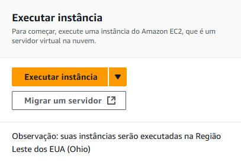

3. Em seguida crie as Tags:

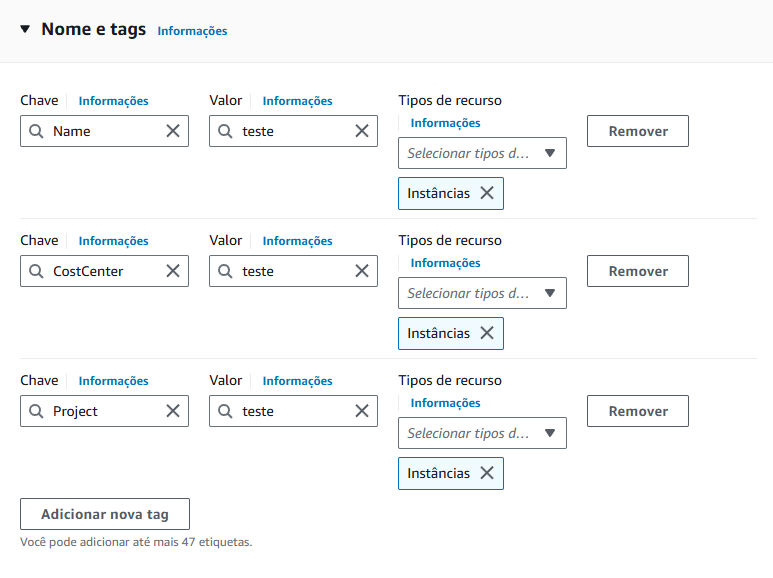
    
**Importante**: Essas tags são importantes, pois estão de acordo com os atributos da política (ABAC) atribuída às contas do Scholarship Program. 


4. Sugestão de criação da imagem da sua VM:

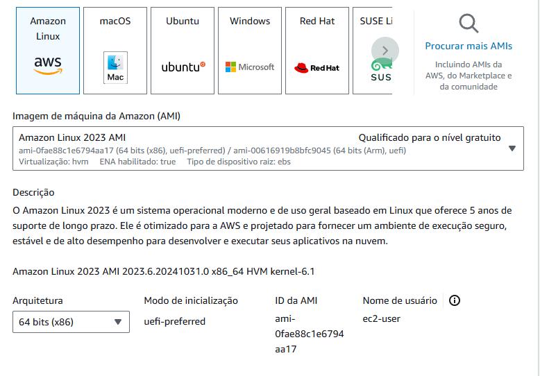

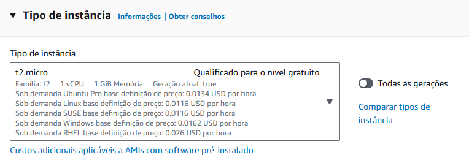


5. Informe o par de chaves criado anteriormente [Configuração de Key Pair](#configuração-de-key-pair).

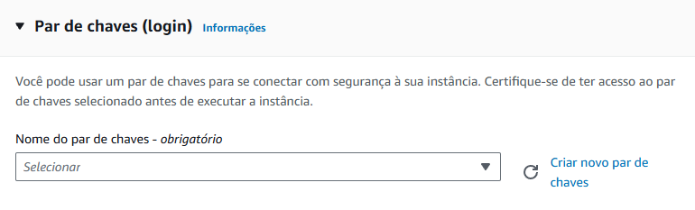


6. Em **Configuração de Rede** clique em **Editar**.

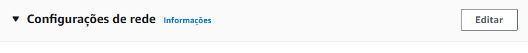


7. Agora informe as suas configurações de rede e segurança:

- Informe sua **VPC** [Configuração da VPC](#configuração-da-vpc).
- Informe a **Sub-rede**.
- Habilite o **IP público**.
- Selecione o **Security Group** [Configuração Security Group](#configuração-security-group)

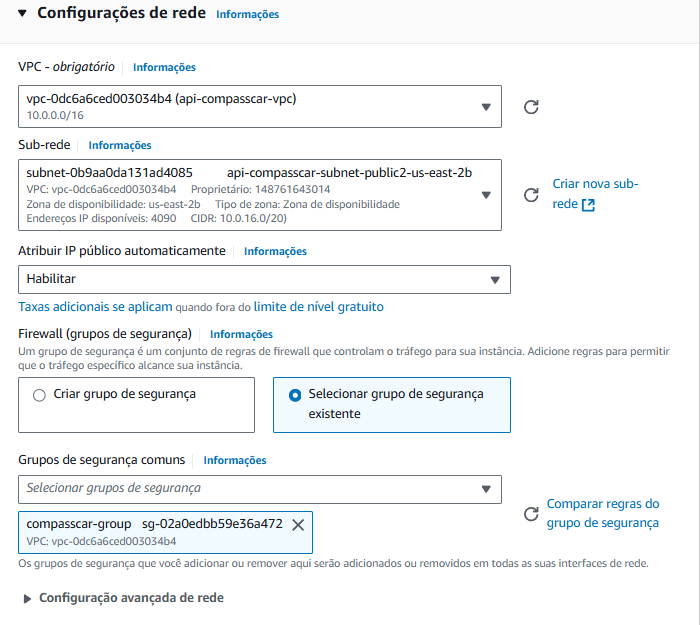

**Atenção!** Informe suas configurações com atenção, é importante que elas estejam corretas.


8. Ao lado, você verá o quadro Resumo. Agora, basta clicar em Executar instância.

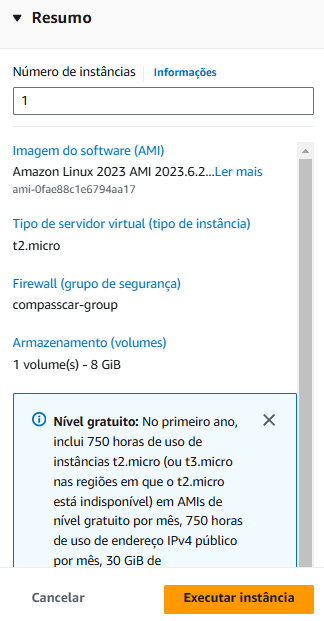

---

**Importante!** Para acessar a instância é preciso se conectar através de SSH e você tem várias formas de fazer isso.
Aqui estão algumas formas comuns:

### Se você for utilizar o **PuTTy** siga esses passos:

## Utilizando PuTTy e PuTTYgen

1. Baixe [PuTTY e PuTTYgen](https://www.putty.org/)
2. Instale os programas

#### Passo 1: Converter a Chave PEM para PPK

1. Abra o **PuTTYgen**.
2. Carregue o arquivo PEM da sua chave. Passo realizado em [Configuração de Key Pair](#configuração-de-key-pair).
3. Para carregar o arquivo PEM, clique em **Load** e depois selecione o arquivo `.pem` ( mude o tipo de arquivo para "All Files" ).
4. Salve o arquivo PPK, após carregar o `.pem `, clique em **Save private key** e guarde o arquivo `bash .ppk `.

#### Passo 2: Acessar a Instância com PuTTY

1. Abra o **PuTTY**.
2. No campo **Host Name (or IP address)**, insira `bash ec2-user@{your-ec2-public-dns}`
3. Em **Connection** > **SSH** > **Auth**, selecione o arquivo  `.ppk`.
4. Em Session, salve a configuração para reutilizar e clique em Open para conectar-se.

---

### Se for utlizar o **terminal** siga esses passos:

## Utilizando o **Terminal** 

### Passo 1: Gerar as chaves **SSH**

1. Abra o seu terminal, no meu caso utilizei o Git Bash. Você pode baixa-lo em [Git](https://git-scm.com/downloads).
2. No terminal digite `cd .ssh`
3. Para gerar uma nova chave **SSH**, digite o comando:
   ```bash
   ssh-keygen -t rsa -b 4096 -C "your_email@example.com"
   ```
4. Adicione a Chave ao Agente SSH:
   
```bash
eval "$(ssh-agent -s)"
ssh-add ~/.ssh/nome-da-chave
```
   
5. Exibir a Chave Pública e Copiá-la:
 ```bash
   cat ~/.ssh/id_rsa.pub
 ```

6. Acessar a instância EC2:

```bash 
ssh -i /path/to/your-private-key.pem ec2-user@<ec2-ip-address>
 ```

Coloque o caminho da chave que você criou na AWS.

7. Dentro da sua instância, Verifique ou crie o arquivo authorized_keys:

```bash
touch ~/.ssh/authorized_keys
chmod 600 ~/.ssh/authorized_keys
```

8. Adicione a chave pública gerada nos passos acima ao arquivo authorized_keys:

```bash
echo "ssh-rsa AAAAB3...your-public-key... rest of your key" >> ~/.ssh/authorized_keys
```

9. Verifique as permissões do diretório e arquivos:

```bash
chmod 700 ~/.ssh
chmod 600 ~/.ssh/authorized_keys
```

Agora a proxima vez que for conectar a sua instância via terminal passe o caminho da sua nova chave privada, exemplo:

```bash
ssh -i "/path/to/your-private-key/.ssh/sua-nova-chave-privada" ec2-user@<ec2-ip-address>
```

---

### Se for utilizar o **MobaXterm** siga esses passos:

## Utilizando MobaXterm

1. Baixe o [MobaXterm](https://mobaxterm.mobatek.net/download.html).
2. Instale o MobaXterm no seu sistema.
3. Abra o MobaXterm e vá para a opção **"Session"** no menu principal para iniciar uma nova conexão.
4. Clique em **"SSH"** para conectar à sua instância EC2.
5. Em **Remote host** insira o IP público de sua instância.
6. Marque a opção **Specify username** e digite **ec2-user**.
7. Clique **Advanced SSH settings**.
8. Marque a opção **Use private key** e selecione o arquivo `.pem` da sua chave.
9. Com a sessão configurada, clique duas vezes sobre ela no painel esquerdo do MobaXterm para iniciar a conexão.

---

## Hora do Deploy 

Este guia passo a passo explica como **deployar** a API CompassCar utilizando **Docker** e **Docker Compose** em uma instância EC2 da AWS.

## Pré-requisitos

Antes de começar, você precisará de:

- Uma **instância EC2** na AWS com o sistema **Amazon Linux**. Passo a passo em: [Configuração da EC2](#configuração-da-ec2) e [Criando instância EC2](#criando-instância-ec2).
- Acesso **SSH** à instância. Passo a passo em: [Utilizando PuTTy e PuTTYgen](#utilizando-putty), [Utilizando MobaXterm](#utilizando-mobaxterm) ou [Utilizando o Terminal](#utilizando-o-terminal).
- A **chave SSH** para conectar à instância EC2. Passo a passo em: [Configuração de Key Pair](#configuração-de-key-pair).
- Conta no **GitHub** para clonar o repositório.

## Passo 1: Conectar à sua Instância EC2

1. Conecte-se à sua instância EC2 via, Putty, MobaXterm ou SSH:

    ```bash
    ssh -i "seu-arquivo.pem" ec2-user@seu-ip-publico
    ```

## Passo 2: Instalar o Docker

1. Atualize o sistema e instale o Docker:

    ```bash
    sudo yum update -y
    sudo yum-config-manager --enable rhui-REGION-rhel-server-extras
    sudo yum install docker -y
    ```

2. Inicie o Docker e habilite-o para iniciar automaticamente:

    ```bash
    sudo systemctl start docker
    sudo systemctl enable docker
    ```

3. Verifique o status do Docker para garantir que foi instalado corretamente:

    ```bash
    sudo systemctl status docker
    ```

## Passo 3: Instalar o Docker Compose

1. Baixe e instale a versão mais recente do Docker Compose:

    ```bash
    sudo curl -L "https://github.com/docker/compose/releases/download/$(curl -s https://api.github.com/repos/docker/compose/releases/latest | grep -oP '"tag_name": "\K(.*)(?=")')/docker-compose-$(uname -s)-$(uname -m)" -o /usr/local/bin/docker-compose
    ```

2. Dê permissão de execução para o Docker Compose:

    ```bash
    sudo chmod +x /usr/local/bin/docker-compose
    ```

3. Verifique se o Docker Compose foi instalado corretamente:

    ```bash
    docker-compose --version
    docker --version
    ```

## Passo 4: Instalar o Node.js (usando NVM)

1. Baixe e instale o **NVM** (Node Version Manager):

    ```bash
    curl -o- https://raw.githubusercontent.com/nvm-sh/nvm/v0.39.3/install.sh | bash
    ```

2. Adicione as configurações ao seu shell para carregar o NVM automaticamente:

    ```bash
    echo "export NVM_DIR=\"$HOME/.nvm\"" >> ~/.bashrc
    echo "[ -s \"$NVM_DIR/nvm.sh\" ] && \. \"$NVM_DIR/nvm.sh\"" >> ~/.bashrc
    ```

3. Recarregue o arquivo de configuração do shell:

    ```bash
    source ~/.bashrc
    ```

4. Verifique se o NVM foi instalado corretamente:

    ```bash
    nvm --version
    ```

5. Instale o Node.js usando o NVM. Você pode escolher a versão desejada (exemplo da versão utilizada no projeto: versão 20.18.0):

    ```bash
    nvm install 20.18.0
    ```

6. Utilize a versão do Node.js que acabou de instalar:

    ```bash
    nvm use 20.18.0
    ```

7. Verifique a versão atual do Node.js:

    ```bash
    node -v
    ```

## Passo 5: Instalar o Git

1. Instale o Git:

    ```bash
    sudo yum install git -y
    ```

2. Verifique se o Git foi instalado corretamente:

    ```bash
    git --version
    ```

## Passo 6: Clonar o Repositório da API

1. Clonar o repositório da API:

    ```bash
    git clone https://github.com/rickRiquie/aws_node_ago24_desafio03_aws.git
    ```

2. Acesse o diretório do projeto:

    ```bash
    cd aws_node_ago24_desafio03_aws
    ```

## Passo 7: Criar o Arquivo `.env`

1. Crie o arquivo `.env` na raiz do projeto para configurar as variáveis de ambiente:

    ```bash
    nano .env
    ```

2. Insira as variáveis necessárias para o funcionamento da aplicação. Exemplo:

    ```env
    # Variáveis de configuração do MySQL
    MYSQL_ROOT_PASSWORD=sua_senha_root_mysql
    MYSQL_DATABASE=nome_do_banco
    MYSQL_USER=seu_usuario_mysql 
    MYSQL_PASSWORD=sua_senha_mysql 

    # Variáveis para conexão da aplicação com o banco de dados
    DB_HOST=localhost
    DB_USER=seu_usuario 
    DB_PASSWORD=sua_senha 
    DB_NAME=nome_do_banco
    DB_PORT=3306

    # Configurações da aplicação
    PORT=8080
    NODE_ENV=production
    ```

3. Salve e feche o arquivo.

## Passo 8: Instalar Dependências

1. Instale as dependências do projeto:

    ```bash
    npm install
    ```

## Passo 9: Subir os Containers com Docker Compose

1. Construa as imagens do Docker:

    ```bash
    sudo docker-compose build
    ```

2. Suba os containers em segundo plano:

    ```bash
    sudo docker-compose up -d
    ```

## Passo 10: Iniciar a API

1. Inicie a API utilizando o comando:

    ```bash
    npm run dev
    ```

Sua API agora deve estar em funcionamento na instância EC2 e acessível na porta configurada (`8080`).

---

## Deploy Automatizado para EC2 com GitHub Actions

Este projeto inclui um workflow automatizado para deploy contínuo (CD) utilizando GitHub Actions, com o objetivo de realizar o deploy de uma API Node.js em uma instância EC2 da AWS. Abaixo, explico as etapas que compõem esse processo.


1. **Configuração SSH:** [Utilizando o Terminal](#utilizando-o-terminal).
   - O segundo passo é a de configuração da chave SSH para poder se conectar à instância EC2 de maneira segura. A chave privada é armazenada como um secret no GitHub (em secrets.EC2_SSH_KEY).
     
```yaml
- name: Configurar SSH
  uses: webfactory/ssh-agent@v0.5.3
  with:
    ssh-private-key: ${{ secrets.EC2_SSH_KEY }}
```

2. **Configurar variáveis de ambiente na instância EC2:**
   - O próximo passo é configurar as variáveis de ambiente. Para isso é necessário configurar os secrets em seu GitHub, exemplo de `.env` para colocar nos secrets:

```env
# Variáveis de configuração do MySQL
MYSQL_ROOT_PASSWORD=
MYSQL_DATABASE=
MYSQL_USER=
MYSQL_PASSWORD=

# Outras variáveis de configuração
DB_HOST=
DB_USER=
DB_PASSWORD=
DB_NAME=
DB_PORT=3306

# Configurações da aplicação
PORT=8080
NODE_ENV=production
```

- Preencha os espações vazios com suas informações.

3. **Fazendo o Deploy**: Para acionar manualmente o workflow, siga estas etapas:
    - Vá para a aba Actions do repositório.
    - Selecione o workflow Deploy para EC2.
    - Clique em Run workflow.
  
4. **Acesso à EC2:** Após o deploy ser realizado, a aplicação estará disponível na sua instância EC2 configurada. Para acessar a EC2 via SSH, use a chave privada configurada:
```bash
ssh -i path/to/your/private-key.pem ec2-user@<EC2_HOST>
```
- Você pode fazer o passo a passo para a a criação de novas chaves em: [Utilizando o Terminal](#utilizando-o-terminal). 


   


